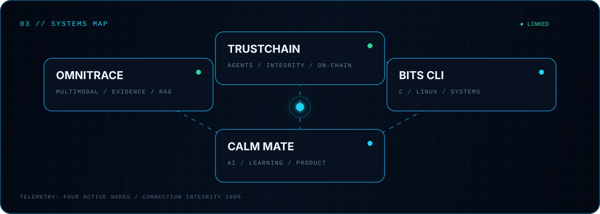

<div align="center">

<a href="https://github.com/Shreshtha280407">
  
</a>

<br/>

[](https://github.com/Shreshtha280407)
[](https://github.com/Shreshtha280407?tab=followers)
[](https://github.com/Shreshtha280407?tab=repositories)

</div>

## `01 // OPERATOR PROFILE`

```yaml
identity: Shreshtha
role: Software Engineer · System Builder · AI Native
mission: Build systems that feel alive, observable, and intentional.
current_vector:
  - multimodal retrieval and evidence systems
  - trustworthy, auditable AI agents
  - useful developer tools and human-centered products
status: online / building
```

## `02 // LIVE CONTRIBUTION SIGNAL`

<div align="center">

[](https://github.com/Shreshtha280407)

<picture>
  <source media="(prefers-color-scheme: dark)" srcset="https://raw.githubusercontent.com/Shreshtha280407/Shreshtha280407/output/github-contribution-grid-snake-dark.svg" />
  <source media="(prefers-color-scheme: light)" srcset="https://raw.githubusercontent.com/Shreshtha280407/Shreshtha280407/output/github-contribution-grid-snake.svg" />
  
</picture>

<table>
  <tr>
    <td>
      
    </td>
    <td>
      
    </td>
  </tr>
</table>

</div>

## `03 // SYSTEMS MAP`

<div align="center">
  
</div>

<table>
  <tr>
    <td width="50%" valign="top">
      <h3><a href="https://github.com/Shreshtha280407/OmniTrace">◈ OmniTrace</a></h3>
      <p>Multimodal evidence infrastructure that turns video, audio, images, and documents into connected, RAG-ready evidence bundles.</p>
      <code>Python</code> <code>FastAPI</code> <code>MongoDB Atlas</code> <code>AI/RAG</code>
    </td>
    <td width="50%" valign="top">
      <h3><a href="https://github.com/Shreshtha280407/TrustChain">◇ TrustChain</a></h3>
      <p>A multi-agent AI system where decisions, tool calls, and agent hand-offs are recorded as verifiable on-chain receipts.</p>
      <code>Next.js</code> <code>FastAPI</code> <code>LangGraph</code> <code>Solidity</code>
    </td>
  </tr>
  <tr>
    <td width="50%" valign="top">
      <h3><a href="https://github.com/Shreshtha280407/AI-Study-Companion-CALM-MATE">△ Calm Mate</a></h3>
      <p>An AI study companion for personalized practice, flashcards, quizzes, and progress tracking.</p>
      <code>React</code> <code>Firebase</code> <code>Groq</code> <code>JavaScript</code>
    </td>
    <td width="50%" valign="top">
      <h3><a href="https://github.com/Shreshtha280407/BITS-SGA-2-CLI">□ BITS CLI</a></h3>
      <p>Linux systems work spanning shell automation, process management, system calls, pipelines, and recovery workflows.</p>
      <code>C</code> <code>Linux</code> <code>Shell</code> <code>Systems</code>
    </td>
  </tr>
</table>

## `04 // TOOLCHAIN`

<div align="center">

[](https://skillicons.dev)

</div>

```text
AI / DATA       multimodal pipelines · RAG · agents · retrieval · evaluation
BACKEND         Python · FastAPI · APIs · MongoDB · system design
FRONTEND        TypeScript · JavaScript · React · Next.js
SYSTEMS         C · Linux · shell · Git · Docker
```

## `05 // CONTACT TERMINAL`

<div align="center">
  <a href="https://github.com/Shreshtha280407"></a>
</div>

```console
$ whoami
Shreshtha — building the next system.

$ status
ONLINE · OPEN TO IDEAS · SHIPPING
```

<div align="center">
  <sub><code>END OF TRANSMISSION // SIGNAL REMAINS ACTIVE</code></sub>
</div>
